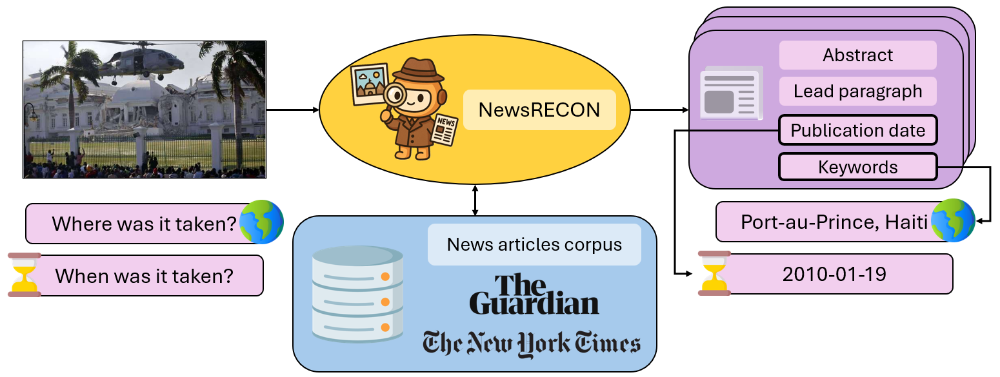

### NewsRECON: News article REtrieval for image CONtextualization

[](https://opensource.org/licenses/Apache-2.0)
[](https://www.python.org/)

This repository contains the code and data for the arXiv preprint "NewsRECON: News article REtrieval for image CONtextualization". The code is released under an **Apache 2.0** license.

This code should only be used for **academic non-commercial research purposes**.

Contact person: [Jonathan Tonglet](mailto:jonathan.tonglet@kuleuven.be) 

Don't hesitate to email us or report an issue if something is broken (and it shouldn't be) or if you have further questions. 

## Abstract

> Identifying when and where a news image was taken is crucial for journalists and forensic experts to produce credible stories and debunk misinformation. While many existing methods rely on reverse image search (RIS) engines, these tools often fail to return results, thereby limiting their practical applicability. In this work, we address the challenging scenario where RIS evidence is unavailable. We introduce NewsRECON, a method that links images to relevant news articles to infer their date and location from article metadata. NewsRECON leverages a corpus of over 90,000 articles and integrates: (1) a bi-encoder for retrieving event-relevant articles; (2) two cross-encoders for reranking articles by location and event consistency. Experiments on the TARA and 5Pils-OOC show that NewsRECON outperforms prior work and can be combined with a multimodal large language model to achieve new SOTA results in the absence of RIS evidence.

<p align="center">
  
</p>

## Environment

Follow these instructions to recreate the environment used for all our experiments.

```
$ conda create --name newsrecon python=3.9
$ conda activate newsrecon
$ pip install -r requirements.txt
```


## Datasets preparation

### TARA

The TARA dataset can be accessed by following the instructions in the [repo](https://github.com/zeyofu/TARA).

Images can be downloaded by running this script

```
python download_tara_images.py
```

### 5Pils-OOC

The 5Pils-OOC dataset can be accessed by following the instructions in the [repo](https://github.com/UKPLab/naacl2025-cove).


## News articles corpus

Below are the instructions for collecting the article corpus we used in our experiments.

Before starting, you need to obtain your own API keys for the New York Times and The Guardian APIs. 
Replace "YOUR_NYT_API_KEY" and "YOUR_GUARDIAN_API_KEY" in '''download_nyt_articles.py''' and '''download_guardian_articles.py''' by your own API keys, respectively.

Then, run the following scripts as follows

```
# Download articles
python download_nyt_articles.py
python download_guardian_articles.py
# Images
python download_nyt_image.py
python download_guardian_image.py
# Remove articles with an image that is identical to one of the input images of the TARA dataset
python remove_duplicates.py
# Remove articles that are not relevant
python preprocessing_qwen.py
# Generate news captions based on the abstracts of the corpus and TARA articles
python caption_generation.py  --input_folder data/processed_articles
python caption_generation.py  --input_folder data/tara_articles
```

Important note: we cannot guarantee that the APIs will return the exact same set of articles as obtained during our experiments. The current scripts automatically remove articles that were not part of the original corpus. However, it cannot guarantee that the API will return all the articles from the original corpus.

## Experiments

### Training NewsRECON

```
# Collect relevant article sets for the ARA train and dev set
python get_relevant_articles_sets.py
# Fine-tune the bi-encoder
python bi_encoder_ft.py
# Train the location cross-encoder
python cross_encoder_ft_location.py
# Train the event cross-encoder 
python cross_encoder_ft_event.py
```

### NewsRECON at inference time

To retrieve the top-k articles given a query image at inference time, use the following scripts: 

```python
# For location
python retrieve_top_k_articles.py --method biencoder_then_ce_mul_rerank --dataset tara --split test --task location 
# For Date
python retrieve_top_k_articles.py --method biencoder_then_time_ce_cluster_rerank --dataset tara --split test --task time --operations concatenation-multiplication-difference 
```

### Question answering with MLLMs

To evaluate the MLLM in zero-shot without external evidence, you can use: 

```
python question_answering.py --dataset tara
```

To evaluate the MLLM combined with evidence retrieved by NewsRECON (or another retrieval model of your choice), you can use:

```
python question_answering.py --dataset tara  --evidence_file YOUR_EVIDENCE_FILE_PATH 
```

### Optional: using the AWS celebrity rekognition API

If you want to evaluate MLLMs with celebrity metadata as additional input, you need first to query the AWS celebrity rekognition API.
For this, you need to obtain your own API keys.

Then, run the following script

```
python celebrity_detection.py
```

You can add the celebrity metadata by changing the prompt type during question answering

```
python question_answering.py --dataset tara  --prompt celebrity
```

### Evaluation

To evaluate a JSON file containing the results, run the following script, specifying the dataset name, the split, and the task.
ks is the number of retrieved articles to consider for EM@k.
Finally, you need to provide a valid geonames username to match predicted locations to their coordinates and hierarchies. This is required for the CODelta and GREAT evaluation metrics.

Here is an example to evaluate location prediction on the TARA test set.

```python
from evaluation_metrics import *
evaluate(your_results_file, dataset="tara", split="test", task="location", ks=5, geonames_user="YOUR_GEONAMES_USERNAME")
```

## Citation

If you find this work relevant to your research or use this code in your work, please cite our paper as follows:

```bibtex 
@article{tonglet2026newsrecon,
  title={NewsRECON: News article REtrieval for image CONtextualization},
  author={Tonglet, Jonathan and Gurevych, Iryna and Tuytelaars, Tinne and Moens, Marie-Francine},
  journal={arXiv preprint arXiv:2601.14121},
  year={2026},
  url={https://arxiv.org/abs/2601.14121},
  doi={10.48550/arXiv.2601.14121}
}
```


## Disclaimer

> This repository contains experimental software and is published for the sole purpose of giving additional background details on the respective publication.
